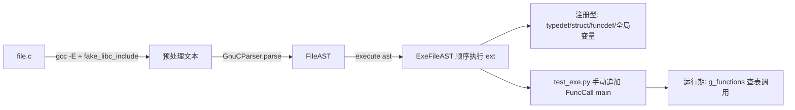
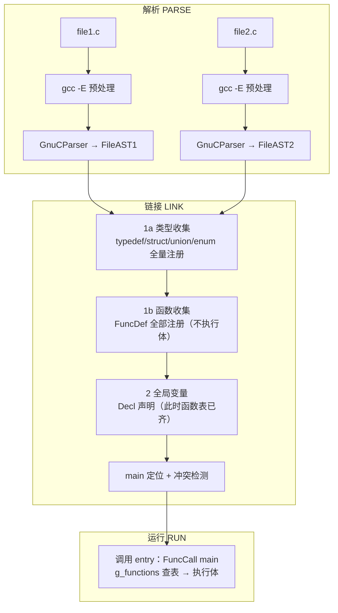

# 设计文档：多 .c 文件支持（CProgram）

> 目标：让 `execute.py` 解释器支持**多个 .c 文件组成的程序**——跨文件类型可见、函数可相互调用、自动定位 `main` 入口。
> 现状基线：lab/learning `5550bb5`（M0-M5 类型系统完成，`typesys.py` + `execute.py`）

---

## 一、现状分析

### 1.1 当前单文件执行流程



- `parse_file()`（pycparser）+ `GnuCParser`（GCC 扩展）→ 单个 `FileAST`；
- `execute(ast)` → `ExeFileAST` 逐个执行 `ext`：
  - `Typedef` → 注册类型别名（`g_types`）
  - `Struct/Union/Enum` → 注册标签 + 布局（`g_types`）
  - `FuncDef` → 注册 `Function`（**只注册、不执行函数体**）
  - `Decl/DeclList` → 声明全局变量（`g_scope`，init 立即求值）
- 入口无机制：`test_exe.py` 手动 `ast.ext.append(FuncCall(main))` 后执行。

### 1.2 全局状态——多文件的天然基础

| 全局 | 内容 | 跨文件行为 |
|---|---|---|
| `g_scope` | 全局变量作用域 | 模块级全局，`execute()` 多次调用间保留 → 文件间变量可见 |
| `g_functions` | 函数表 `name → Function` | 同上 → 文件间函数可见 |
| `g_types` | 类型注册表（内建/标签/别名） | 同上 → 文件间类型可见 |

**关键结论**：解释器没有"文件"边界——所有注册都是全局的。因此**顺序执行多个 FileAST 已经具备"链接"的大部分能力**：A 的类型/函数/全局变量在 B 中可用（前提是 A 先被 execute）。

### 1.3 已具备的多文件能力

- ✅ 跨文件类型：`struct S` 在 A 定义、B 使用（`_register_compound` 全局标签表）
- ✅ 跨文件 typedef 链：`type_of_decl` 全局解析
- ✅ 函数注册与执行分离：`FuncDef` 只注册，调用时才执行体
- ✅ GNU 扩展解析：`GnuCParser` 逐文件可用

### 1.4 现状缺口（问题清单）

| # | 问题 | 说明 |
|---|---|---|
| P1 | **无两遍注册** | `main` 调 B 的函数时，若 B 的 `FuncDef` 尚未执行 → "Undefined function"。需要先全量注册函数，再执行 |
| P2 | **无 main 定位** | 无自动入口检测，`test_exe.py` 手动 append；多文件时不知 main 在哪个文件 |
| P3 | **重复定义静默覆盖** | `register_typedef`/`register_tag` 是裸 dict 赋值：A、B 各定义 `typedef int X;` → 相同则无害，**冲突（`int X` vs `char X`）无告警** |
| P4 | **static 函数同名冲突** | C 允许不同文件的 `static f()` 同名；`g_functions` 按名字全局键控 → 后者覆盖前者（v1 先告警，正式支持留后续） |
| P5 | **顶层声明依赖顺序** | 全局 `int x = helper();` 的 init 在注册期求值，若 `helper` 在本文件后面定义 → 失败。需要函数表先齐 |
| P6 | **无统一 API/CLI** | 多文件没有入口：`load_program(["a.c","b.c"]).run()` |
| P7 | **头文件内容重复** | 每个文件独立预处理，共享头（如自建 `util.h`）的声明会重复进入各 AST → 靠 `_register_compound` 的"已完整则返回"宽松兜底，但 typedef 冲突需 P3 的检测 |

---

## 二、多文件执行模型（设计）

### 2.1 总体流程：解析 → 链接 → 运行（三段式）



> 同一流程的白板版（可编辑）：![[多文件-解析链接运行.excalidraw|1100]]

**为什么两遍能解决前向引用**：
- 函数调用在**运行期**查 `g_functions`（执行体时才解析）→ 1b 全量注册后，任何文件的调用都能命中；
- 类型引用在**注册期**经 `type_of_decl` 解析 → 1a 全量类型注册后，1b 的函数签名、2 的全局变量类型都能解析；
- 全局变量的 init 在链接阶段执行（函数表已齐）→ `int x = helper();` 可用（P5 解决）。

### 2.2 main 定位（P2）

- **自动**：扫描所有 FileAST 的 `FuncDef`，取 `decl.name == entry`（默认 `'main'`）；
- 找不到 → `AssertionError("未找到入口函数 'main'")`；
- 多个 → 取第一个 + 警告；
- 可显式指定 `entry`（如纯函数库无 main 的场景，测试入口自定义）。

### 2.3 去重与冲突检测（P3/P4/P7）

| 场景 | 行为 |
|---|---|
| typedef/struct/union/enum **相同定义**（同一类型对象） | 静默跳过（当前 `_register_compound` 已如此；typedef 需加"对象同一性"判断） |
| typedef **冲突**（同名不同类型） | **警告**（默认）/ 报错（严格模式 `strict=True`） |
| 函数**重名**（非 static） | 报错（C 语义：重复定义） |
| 函数**重名**（static，不同文件） | v1 警告 + 后者覆盖；正式支持依赖文件级作用域（见 §6） |
| 全局变量**重名** | 报错 |
| 头文件重复声明 | 靠 1a 类型收集 + 相同定义去重兜底（P7） |

### 2.4 顶层语句处理（P5 延伸）

- **支持**：定义型顶层——`typedef` / `struct`/`union`/`enum` / `FuncDef` / 全局变量 `Decl`（init 可为函数调用）；
- **v1 边界**：顶层非常量表达式/可执行语句（如直接调用语句）→ 链接后按序执行或警告跳过；
- `_Static_assert`：链接期检查（编译期语义，符合设计）。

---

## 三、详细设计：program.py

### 3.1 API

```python
"""program.py — 多 .c 文件程序装载/链接/运行（M6）"""

class CProgram:
    """一组 C 源文件组成的程序。

    用法：
        prog = CProgram(["lib.c", "main.c"])
        prog.load()          # 解析全部文件 → FileAST[]
        prog.link()          # 1a 类型 → 1b 函数 → 2 全局变量（+冲突检测）
        result = prog.run()  # 调用 main()
    """

    def __init__(self, files, entry="main", cpp_path="gcc", cpp_args=None,
                 parser=None, encoding=None, strict=False):
        self.files = list(files)
        self.entry = entry
        self.cpp_path = cpp_path
        self.cpp_args = cpp_args or ["-E", "-Iutils/fake_libc_include"]
        self.parser = parser or ext_c_parser.GnuCParser()
        self.strict = strict
        self.asts = []          # list[FileAST]
        self.entry_file = None  # 含入口函数的文件

    # ---- 阶段 API ----
    def load(self): ...
    def link(self): ...
    def run(self, *args): ...

    # ---- 便捷 ----
    @classmethod
    def load_and_run(cls, files, entry="main", **kw):
        prog = cls(files, entry, **kw)
        prog.load(); prog.link()
        return prog.run()
```

### 3.2 核心实现

```python
def load(self):
    for f in self.files:
        ast = parse_file(f, use_cpp=True, cpp_path=self.cpp_path,
                         cpp_args=self.cpp_args, parser=self.parser,
                         encoding=self.encoding)
        self.asts.append(ast)
    return self.asts

def link(self):
    # 1a 类型收集：typedef/struct/union/enum 全量注册
    for ast in self.asts:
        for ext in ast.ext or []:
            if isinstance(ext, (c_ast.Typedef, c_ast.Struct, c_ast.Union, c_ast.Enum)):
                execute(ext)          # 复用现有注册逻辑（含冲突检测钩子）
    # 1b 函数收集：FuncDef 全部注册（不执行体）
    for ast in self.asts:
        for ext in ast.ext or []:
            if isinstance(ext, c_ast.FuncDef):
                _check_func_conflict(ext)     # 重名检测（P4）
                execute(ext)
    # 2 全局变量 + 其余顶层（此时函数表已齐）
    for ast in self.asts:
        for ext in ast.ext or []:
            if isinstance(ext, (c_ast.Decl, c_ast.DeclList)):
                execute(ext)
            elif isinstance(ext, c_ast.StaticAssert):
                execute(ext)
    self._resolve_entry()
    return self

def run(self, *args):
    """调用入口函数；args 为 int 参数列表。"""
    assert self.entry in g_functions, f"未找到入口函数 '{self.entry}'"
    call = c_ast.FuncCall(name=c_ast.ID(self.entry),
                          args=c_ast.ExprList([c_ast.Constant(type='int', value=str(a))
                                               for a in args]) if args else None)
    return execute(call)
```

### 3.3 冲突检测钩子（P3/P4）

- **typedef 冲突**：链接 1a 前，预扫描各 AST 收集 `(typedef名, 目标类型)`；对重名项用 `types_equivalent(a, b)` 比对：
  ```python
  def types_equivalent(t1, t2):
      """结构等价：同对象 / 同名同构（BasicType 比 name+size；StructType 比成员名序列）。"""
      if t1 is t2: return True
      if isinstance(t1, BasicType) and isinstance(t2, BasicType):
          return t1.name == t2.name and t1.size == t2.size
      if isinstance(t1, StructType) and isinstance(t2, StructType):
          return [m.name for m in t1.members] == [m.name for m in t2.members]
      return False
  ```
  相同 → 跳过；不同 → `strict` 时抛错，否则 `warn`。
- **函数重名**：1b 前扫描 `FuncDef.decl.name` 计数；非 static（`'static' in decl.storage`）重名 → 报错；static 重名 → 警告 + 后者覆盖（v1）。
- **全局变量重名**：2 阶段声明前检查 `g_scope` 是否已存在同名符号。

### 3.4 与现有代码的集成

- **零侵入**：复用 `execute()` 按节点分发 + 全局状态；不改 `typesys.py`/`execute.py` 核心；
- 新增 `program.py`（仓库根目录，与 execute.py 并列）；
- `test_exe.py` 可改用 `CProgram(["test/main.c"])`（行为等价，去掉手动 append）；
- 冲突检测辅助函数放 program.py（或 typesys.py 的 `types_equivalent`）。

---

## 四、测试计划

新增 `test_program.py`（沿用 test_typesys.py 风格）：

| # | 用例 | 验证点 |
|---|---|---|
| T1 | 双文件基础：`lib.c`（`int helper(){return 42;}` + `struct Pt{x,y;}`），`main.c`（`main` 调 helper + 用 Pt） | 跨文件函数/类型可见，`main()=42` |
| T2 | 前向引用：`main.c` 在前、`lib.c` 在后 | 链接两遍注册解决（P1） |
| T3 | 跨文件 typedef 链 | `type_of_decl` 全局解析 |
| T4 | 全局变量 init 含函数调用：`int g = helper();` | 函数表先齐（P5） |
| T5 | main 定位：多文件找 main / 无 main 报错 / 多 main 警告取第一 | P2 |
| T6 | 重复定义：相同 typedef 静默 / 冲突 typedef 告警（strict 报错） | P3 |
| T7 | 端到端三文件：`lib.c` + `util.c` + `main.c`（struct 传参、enum、值拷贝混合） | 综合 |
| T8 | 入口参数：`run(3, 4)` | `main(int argc, char**argv)` 简化支持 |

## 五、实施计划

| 阶段 | 内容 | 验收 |
|---|---|---|
| **S1**（1 天）✅ 已完成 | `program.py` 骨架：`load/link/run` 最小版 + `_resolve_entry` | ✅ T1/T2/T5 通过；`test_exe.py` 改用 `CProgram` 后行为不变（`main()=165`） |
| **S2**（1 天）✅ 已完成 | 冲突检测：`types_equivalent` + typedef/函数/全局变量重名处理 | ✅ T3/T6 通过 |
| **S3**（1 天） | 全局变量/顶层语句完善（T4）+ 端到端三文件用例 | T4/T7/T8 通过 |
| **S4**（可选） | static 文件级作用域、头文件去重优化、CLI（`python program.py a.c b.c`） | 后续路线 |

**S2 实现注记**：
- `typesys.py` 新增 `types_equivalent`（结构等价：Basic 比 name+size；指针/数组/函数递归；enum 比常量表；struct/union 比成员名+递归类型）
- `program.py` link() 接入 4 类冲突检测：
  - **typedef 重名**：相同（等价）静默；冲突 → `[warn]` / strict 抛错
  - **struct/union/enum 标签重名**：成员签名比对，冲突 → warn / strict 抛错
  - **函数重名**：非 static 非入口重复 → **报错**（C 语义）；static 重复 → warn（后者覆盖）；入口重复 → 由 `_resolve_entry` 处理（warn + 取第一）
  - **全局变量**：重复裸声明（tentative）跳过保留首个定义；带 init 重名 → warn / strict 抛错
- 测试：`test/multi/` 新增 6 个夹具（tdlib/tdmain 链、cfl_a/b 冲突、dup_a/b 重名）；`test_program.py` 新增 T3/T6（4 组断言）
- 入口函数（main）豁免于"非 static 重复报错"规则（与 T5 的"多 main 警告取第一"一致）

**S1 实现注记**：
- 新增 `program.py`（CProgram：load/link/run + _resolve_entry + load_and_run）；`test/multi/`（lib.c / main.c / other_main.c 三用例文件）；`test_program.py`（T1/T2/T5）
- 顺带修复两个潜在问题：
  1. **函数原型**：`int foo(void);` 顶层声明此前被当作变量声明（产生垃圾变量）——`ExeDecl` 现在跳过 `FuncType` 类型声明（定义由 FuncDef 注册），多文件场景必需；
  2. **`TypeDeclExt`/`ArrayDeclExt` 的 `__slots__` 未初始化**：`asm`/`attributes`/`init` 字段缺省访问会 AttributeError（test_exe.py 之前靠 monkey-patch 兜底）——已给两个类补上带默认值的 `__init__`，**根因修复**；
  3. `program.py` 内部用 `exe_mod.g_functions` 模块引用（`setup_global_scope()` 会重赋值，import 绑定的旧引用会过期）。

## 六、风险与依赖

| 依赖/风险 | 说明 | 对策 |
|---|---|---|
| static 文件级作用域 | 依赖作用域系统改造（当前 `g_functions` 全局键控） | S4 预留；v1 告警 + 后者覆盖 |
| 顶层可执行语句 | 依赖控制流/表达式完善 | v1 限定定义型顶层，其余警告 |
| 头文件/宏 | 依赖预处理（已具备） | P7 靠类型去重兜底 |
| main 签名 | `int main(int argc, char**argv)` 的参数传递需指针模型（MEM-1） | v1 支持无参/整型参数；argv 留 MEM-1 后 |
| 与类型系统联动 | 链接期类型注册顺序依赖 M0-M5 的注册语义 | 1a→1b→2 的顺序已按注册期/运行期解耦 |

---

*基线：lab/learning `5550bb5`* ｜ *配套：设计文档-类型系统支持.md（类型基础）*
