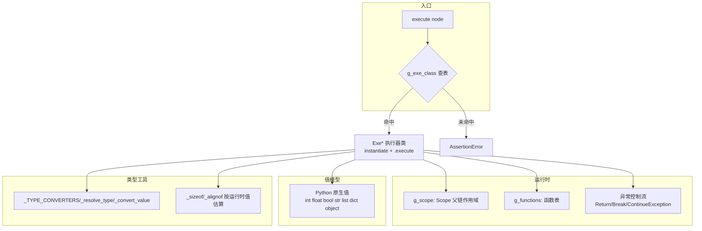

# execute.py 概要设计 + 结构体/枚举体/联合体/typedef 详细设计

> 对象：`19.work-space/pycparser/execute.py`（2001 行，C AST 解释器）
> 配套：`TODO.txt`（开发路线图，本文档是其 MEM-3 / TYPE-1 的详细展开）
> 状态：概要设计基于现状代码；详细设计为提案，待按第三部分计划实施

---

## 一、概要设计（现状）

### 1.1 定位

`execute.py` 是一个**树遍历式 C AST 解释器**：把 pycparser 解析出的 AST（60 种节点 = 49 标准 + 11 GNU 扩展）直接"执行"，目标是能跑通 `test/main.c` 这类解析+执行端到端用例，输出执行结果与作用域快照。

### 1.2 总体架构



> 同一架构的白板版（可编辑）：![[execute-概要架构图.excalidraw|1100]]

### 1.3 执行模型

- **分发机制**：`execute(node)` 用 `node.__class__.__name__` 查 `g_exe_class`（60 项映射），实例化对应 `Exe*` 执行器并调用 `.execute()`。所有执行器继承 `Execute` 基类。
- **树遍历**：语句/表达式执行器递归调用 `execute()` 子节点，逐层求值。
- **控制流**：`Return`/`Break`/`Continue` 通过**异常**展开（`ReturnException` 携带返回值，`Switch`/循环捕获 `Break/ContinueException`）。
- **函数调用**：`ExeFuncCall` 把 `g_scope` 切换到 `Scope(func.closure_scope)`，绑定形参，执行函数体，`finally` 恢复外层作用域。

### 1.4 值模型

一切值都是 **Python 原生类型**，无 C 类型信息：

| C 构造 | 当前 Python 表示 | 问题 |
|---|---|---|
| `int`/`long`/`short` | `int` | 无宽度/符号区分 |
| `float`/`double` | `float` | 无区分 |
| `char` | `int`（`ExeConstant` 把 `'a'` 转 `ord`） | 无字符语义 |
| `_Bool` | `bool` | — |
| 字符串 | `str` | — |
| 数组 | `list` | 无元素类型/维度信息 |
| **struct/union 实例** | `dict`（或任意带属性的 object） | **无布局、无成员类型、无值语义区分** |
| enum 常量 | `int` | 无类型归属 |
| typedef 名 | `None`（仅占位） | **别名未建立** |
| 指针 | 不存在 | `&`/`*`/`->` 未实现（TODO MEM-1） |

### 1.5 作用域与函数

- `Scope`：父链作用域。`get` 沿链查找；`set` 沿链更新；`declare` 仅写当前层（块级遮蔽生效）。
- 全局状态：`g_scope`（当前作用域，函数调用/块进入时被切换/保存）、`g_functions`。
- `Function`：`(name, param_names, body, closure_scope)`——闭包捕获定义时的作用域（简单实现，递归/独立栈帧待 TODO MEM-2）。

### 1.6 节点覆盖（60 = 49 + 11）

- 表达式（11）：Constant ID BinaryOp UnaryOp Assignment TernaryOp Cast ArrayRef StructRef FuncCall ExprList
- 语句（11）：Compound If While DoWhile For Return Break Continue Switch Case Default
- 声明（7）：Decl DeclList FuncDef EmptyStatement Label Goto
- 初始化（3）：InitList NamedInitializer CompoundLiteral
- 类型片段（10）：IdentifierType TypeDecl PtrDecl ArrayDecl FuncDecl ParamList EllipsisParam Typedef Typename Alignas
- 其他（4）：StaticAssert Pragma FileAST + Struct Union Enum Enumerator EnumeratorList
- GNU 扩展（11）：TypeList AttributeSpecifier Asm PreprocessorLine TypeOfDeclaration TypeOfExpression RangeExpression TypeDeclExt ArrayDeclExt StructExt FuncDeclExt

### 1.7 现状问题清单（与类型系统相关，按严重度）

| # | 问题 | 位置 | 影响 |
|---|---|---|---|
| P1 | **struct/union 成员被声明成全局变量**：`struct Point {int px, py};` 会在 `g_scope` 创建 `px=0, py=0` | `ExeStruct`/`ExeUnion`/`ExeStructExt` | 语义错误：成员不属于任何作用域；变量名污染 |
| P2 | **typedef 未建立类型别名**：`ExeTypedef` 只 `declare(name, None)`，后续 `MyType x;` 无法解析为真实类型 | `ExeTypedef` | `MyType` 变量被当作 `int` 处理，类型信息全丢 |
| P3 | **变量无类型信息**：`Scope` 只存值，`sizeof`/`Cast`/类型转换都无从谈起 | `Scope`/`ExeDecl` | 类型系统根基缺失 |
| P4 | `sizeof`/`__alignof__` 按**运行时值**估算且**会求值 operand**（TODO BUG-1/2 已记录） | `ExeUnaryOp` `_sizeof` `_alignof` | `sizeof(x++)` 有副作用；`sizeof(*p)` 会崩 |
| P5 | 无指针模型：`&`/`*`/`->` 未实现；`StructRef.type`（`.` vs `->`）未区分 | `ExeStructRef`/`ExeUnaryOp`/`ExeBinaryOp` | 链表/指针成员/`->` 全不可用（TODO MEM-1） |
| P6 | struct 赋值是 **dict 引用共享**，不是 C 的值拷贝（memcpy 语义） | `ExeAssignment` | `b = a; b.x = 1` 会改到 `a` |
| P7 | `ArrayDecl.dim` 未用于创建定长数组；`int a[3]` 无数组语义 | `ExeDecl` | 数组越界/维度不可知 |
| P8 | enum 常量已注入作用域（基本正确），但 enum 类型本身未注册，无类型归属 | `ExeEnum` | 无法表达 `enum Color` 变量 |
| P9 | 类型片段节点（TypeDecl/PtrDecl/ArrayDecl 等）全部 no-op，类型信息在解析声明时即丢失 | 各 `Exe*` | 与 P3 同源 |

> 结论：**当前解释器是"无类型解释器"**——能用 Python 运算跑通简单 C，但 struct/enum/union/typedef 只做到了"不崩"，未做到"语义正确"。本设计文档解决的就是这一层。

---

## 二、详细设计：结构体 / 枚举体 / 联合体 / typedef 支持

### 2.1 设计目标与总体思路

**目标**（按优先级）：
1. `typedef`：建立类型别名解析链，`MyType x;` 能解析出真实类型；
2. `enum`：枚举常量正确注入作用域 + enum 类型可注册、可被声明引用；
3. `struct`：成员不再污染全局作用域；实例有布局（offset/size/align）；支持初始化、`.成员`访问、值拷贝赋值；
4. `union`：共享存储语义（size = max 成员，offset 全 0）；
5. 顺带把 `sizeof`/`__alignof__` 改成**类型推导**（修 BUG-1/2）。

**总体思路**：引入"类型"作为一等公民，但**与现有框架向后兼容**：

- 新增 `CType` 类型层次 + `TypeRegistry` 注册表（内建类型、标签类型、typedef 别名）；
- `Scope` 存储升级为 `Symbol(value, type)`，但 `get/set` 仍返回纯值（现有 30+ 测试与全部执行器不破坏），新增类型查询 API；
- 各 `Exe*` 执行器在**现有逻辑之上**逐步补充类型注册与类型化操作，按第三部分计划分阶段落地。

### 2.2 CType 类型层次

```mermaid
classDiagram
    class CType {
        +str name
        +int size
        +int align
        +sizeof() int
        +alignof() int
        +is_complete() bool
    }
    class BasicType
    class PtrType {
        +CType points_to
    }
    class ArrayType {
        +CType elem_type
        +int count
    }
    class FuncType {
        +CType ret_type
        +list param_types
        +bool variadic
    }
    class EnumType {
        +dict constants  # name -> int
   {
        +list members    # Member(name, type, offset, bitsize)
    }
    class UnionType kkk}
    class StructType {
        +list members    # Member(name, type, offset, bitsize)
    }
    class UnionType {
        +list memberkks
    }
    CType <|-- BasicType
    CType <|-- PtrType
    CType <|-- ArrayType
    CType <|-- FuncType
    CType <|-- EnumType
    CType <|-- StructType
    CType <|-- UnionType
```

**关键决策**：

- **不建 `TypedefType` 包装类**。C 语义中 `typedef` 不创建新类型（`typedef int MyInt;` 后 `MyInt` 与 `int` 是同一类型），因此别名一律**解析到目标类型**，避免类型比较/转换出现"双胞胎"问题。
- 内建类型为**单例**（`IntType`、`CharType`、`FloatType`、`DoubleType`、`BoolType`、`VoidType`），由 `TypeRegistry` 预注册。
- `size`/`align` 参照 64 位平台常见 ABI：char=1/1、int=4/4、float=4/4、double=8/8、指针=8/8、enum=4/4、void=1/1（`sizeof(void)` 在 C 中非法，解释器可给 1 并告警）。
- `is_complete()`：`size is not None`。**不完整类型**（`struct S;` 前置声明、`int a[];`、自引用 struct 的成员指针声明阶段）size=None。

### 2.3 TypeRegistry 类型注册表

```python
class TypeRegistry:
    def __init__(self):
        self.tags = {}        # ('struct'|'union'|'enum', 标签名) -> CType
        self.aliases = {}     # typedef 名 -> CType（解析后的目标类型）
        self.builtins = {}    # 'int'/'char'/... -> BasicType 单例

    # --- 标签命名空间（struct/union/enum 标签与普通标识符分离） ---
    def register_tag(self, kind, name, ctype): ...
    def lookup_tag(self, kind, name): ...          # 找不到 -> KeyError

    # --- typedef 别名 ---
    def register_typedef(self, name, ctype): ...
    def resolve_typedef(self, name, seen=None):
        """链式解析 typedef，检测循环（A->B->A 报错）"""
        ...

    # --- 统一解析：标识符 -> CType ---
    def resolve(self, names):
        """names 是 IdentifierType.names，如 ['int'] / ['unsigned','long']
           / ['enum','Color'] / ['MyType']"""
        # 1) 'enum X' / 'struct X' / 'union X' -> lookup_tag
        # 2) 拼接后查内建（'unsigned long' 等）
        # 3) 单个名字查 typedef（可链式）
        # 4) 都查不到 -> 报 UndefinedType
```

**命名空间规则**（与 C 一致）：

- **标签命名空间**：`struct`/`union`/`enum` 标签（`struct Point` 的 `Point`）；
- **普通标识符命名空间**：变量、函数、typedef 名、枚举常量；
- 两者互不冲突：`struct Point` 与变量 `Point` 可以共存。

### 2.4 变量存储改造（Scope + Symbol）

```python
class Symbol:
    __slots__ = ('name', 'value', 'type')
    def __init__(self, name, value, type=None):
        self.name = name
        self.value = value
        self.type = type      # CType | None（类型系统未就绪时为 None）

class Scope:
    def __init__(self, parent=None):
        self._symbols = {}    # name -> Symbol
        self._parent = parent

    # ---- 兼容 API：返回纯值（现有执行器/测试不破坏）----
    def get(self, name):      return self._get(name).value
    def set(self, name, value):  self._get(name).value = value
    def declare(self, name, value=None, type=None):
        self._symbols[name] = Symbol(name, value, type)

    # ---- 新增 API ----
    def get_symbol(self, name):  return self._get(name)          # Symbol
    def get_type(self, name):    return self._get(name).type     # CType|None
    def set_type(self, name, type):  self._get(name).type = type
```

> `declare` 增加可选 `type` 参数，默认 `None`——在 M0 阶段所有现有调用点无需改动，M1-M4 逐个填充真实类型。

### 2.5 typedef 详细设计

**语义**：`typedef <类型说明> <别名>;` 把别名登记到普通标识符命名空间，指向解析后的目标类型；**无运行时开销**。

**执行流程**（改造 `ExeTypedef`）：

```
ExeTypedef.execute():
    ctype = type_of_decl(self.node.type)      # 解析声明类型 -> CType
    g_types.register_typedef(self.node.name, ctype)
    # 不再 g_scope.declare(name, None)  —— 别名不属于运行时变量
```

**声明引用**（改造 `ExeDecl` 的类型解析）：`IdentifierType(['MyInt'])` → `g_types.resolve(['MyInt'])` → 链式解析到 `IntType`。

**链式解析与环检测**：

```python
def resolve_typedef(self, name, seen=None):
    seen = seen or set()
    if name in seen:
        raise AssertionError(f"typedef 循环: {' -> '.join(seen | {name})}")
    seen.add(name)
    t = self.aliases.get(name)
    if t is None:
        return self.builtins.get(name)          # 叶子：内建类型
    # t 可能是另一个别名（先存别名链再解析）：
    # 简化：aliases 存 CType；若解析时发现别名指向别名，用 t.name 继续递归
    if t.name in self.aliases or t.name in self.builtins:
        return self.resolve_typedef(t.name, seen)
    return t
```

**要点**：
- typedef 名与变量同名时按 C 规则（同命名空间，后者遮蔽前者）——靠 `Scope` 与 `aliases` 的查询顺序处理；
- 支持 `typedef struct {...} S;`（匿名 struct + typedef）：`type_of_decl` 遇到内联 `Struct` 节点时**注册标签（若命名）并返回 StructType**，然后登记别名 `S`。

### 2.6 enum 详细设计

**语义**：
1. 枚举常量默认从 0 递增；显式值可为任意常量表达式，且**可引用前面的枚举常量**（`A, B = A + 1`）；
2. 枚举常量注入**包含 enum 定义的外围作用域**（C 规则，不是新块）；
3. 若 enum 有标签（`enum Color {...}`），把标签注册到类型注册表；`typedef enum {...} Color` 则别名 `Color` 指向 EnumType。

**执行流程**（改造 `ExeEnum` + `ExeEnumerator`）：

```
ExeEnum.execute():
    constants = {}
    next_value = 0
    for e in node.values.enumerators:
        if e.value is not None:
            v = execute(e.value)      # 显式值；可引用已注入的前一常量
        else:
            v = next_value
        constants[e.name] = v
        g_scope.declare(e.name, v, IntType)   # 注入外围作用域（带类型）
        next_value = v + 1
    if node.name:                     # 有标签才注册类型
        g_types.register_tag('enum', node.name,
                             EnumType(node.name, constants))
```

**enum 变量声明**：`enum Color c;` 的 `IdentifierType.names == ['enum', 'Color']` → `g_types.resolve` 分支 1 查标签 → 返回 `EnumType` → 变量值为 `int`（宽松模式允许任意 int 赋值，严格模式可校验枚举值集合——M5 再定）。

### 2.7 struct 详细设计（重点）

#### 2.7.1 布局计算（offset/size/align）

```python
def align_up(v, a):  return (v + a - 1) // a * a

def compute_struct_layout(members, align_override=None):
    """members: [(name, CType, bitsize_or_None)]"""
    offset, max_align = 0, 1
    layout = []
    for name, ctype, bitsize in members:
        if bitsize is not None:
            # 位域：M3 先简化为按类型对齐占位，位域打包留 M5
            pass
        if ctype.size is None:
            raise AssertionError(f"不完整类型成员: struct.{name}")
        align = ctype.align
        offset = align_up(offset, align)
        layout.append(Member(name, ctype, offset, bitsize))
        offset += ctype.size
        max_align = max(max_align, align)
    size = align_up(offset, max_align)
    align = align_override or max_align   # __attribute__((aligned(N))) 可覆盖
    return layout, size, align
```

**示例**：`struct { char c; int i; }` → `c@0(size1) → 对齐到 4 → i@4(size4) → 总 size 8`。与 C 编译器一致。

#### 2.7.2 值对象 StructValue

```python
class StructValue:
    def __init__(self, type):           # type: StructType
        self.type = type
        self.fields = {}                # 成员名 -> 值
        for m in type.members:
            self.fields[m.name] = default_value(m.type)

    def get(self, name):  return self.fields[name]
    def set(self, name, value):  self.fields[name] = value

    def copy(self):                     # 值拷贝（memcpy 语义）
        new = StructValue(self.type)
        for k, v in self.fields.items():
            new.fields[k] = deep_copy_value(v)   # 递归拷贝（嵌套 struct/数组）
        return new
```

> 用 `StructValue` 而非裸 dict：**区分"struct 实例"与普通 dict**，且实例自带类型（sizeof/类型检查/`->` 支持都依赖它）。

#### 2.7.3 定义与注册（改造 `ExeStruct` / `ExeStructExt`）

```
ExeStruct.execute():
    members = []
    for d in node.decls or []:            # d 是 Decl
        ctype = type_of_decl(d.type)
        members.append((d.name, ctype, d.bitsize))
    layout, size, align = compute_struct_layout(members, align_override=...)
    st = StructType(node.name, members=layout, size=size, align=align)
    if node.name:                          # 有标签才注册
        g_types.register_tag('struct', node.name, st)
    # ★ 不再把成员 declare 到 g_scope（修复 P1）
```

**匿名 struct**（无标签）：仅作为类型出现，不注册（除非经 typedef 引用）。

**不完整类型与自引用**（链表）：

```python
# struct Node; 前置声明：
g_types.register_tag('struct', 'Node', StructType('Node', incomplete=True))
# struct Node { int v; struct Node *next; }:
#   type_of_decl 解析成员 'struct Node' 时查标签 -> 拿到同一 StructType
#   布局计算前把成员填好，size/align 再算出（指针 size=8 已知，无需成员完整）
```

#### 2.7.4 实例化（改造 `ExeDecl`）

```python
# struct Point p;          -> StructValue(PointType)，成员默认值
# struct Point p = {1, 2}; -> InitList 按成员顺序填充
# struct Point p = {.y=2}; -> NamedInitializer 按名填充
ExeDecl.execute():
    ctype = type_of_decl(self.node.type)
    if self.node.init is not None:
        val = execute(self.node.init)             # InitList -> 列表 / 标量
        val = coerce_to_type(val, ctype)          # 按成员表解释/填充
    else:
        val = default_value(ctype)                # StructValue 全零等
    g_scope.declare(name, val, ctype)
```

`coerce_to_type` 规则：
- 目标 `StructType` + 值 `list`（InitList 产物）→ 顺序填充到 `StructValue.fields`，不足补默认值，多余截断（或告警）；
- 目标 `StructType` + 值 `StructValue` → `copy()`（值拷贝）；
- 目标 `ArrayType` + 值 `list` → 校验/截断到维度，存 list；
- 目标标量 + 值标量 → `_convert_value`（现有逻辑）。

#### 2.7.5 成员访问（改造 `ExeStructRef`）

```
ExeStructRef.execute():
    obj = execute(self.node.name)
    field = 成员名
    if self.node.type == '.':                  # 直接成员
        if isinstance(obj, StructValue):  return obj.get(field)
        if isinstance(obj, UnionValue):   return obj.get(field)   # 活跃成员
        raise AssertionError("'.' 作用于非 struct/union")
    else:                                      # '->' 指针成员
        # M3：若 obj 是 StructValue 退化为 '.'（宽松）；正式支持依赖 MEM-1 指针模型
        if isinstance(obj, StructValue):  return obj.get(field)
        raise AssertionError("'->' 需要指针模型支持（TODO MEM-1）")
```

**lvalue 写路径**（改造 `ExeAssignment._set_lvalue`）：`ID` / `ArrayRef` / `StructRef` 分支中，`StructRef` 写 `obj.set(field, value)`（`StructValue` 分支）。

#### 2.7.6 赋值语义（值拷贝）

`b = a;`（都是 struct）→ `coerce_to_type` 走 `StructValue.copy()`（深拷贝）。
`b.x = 1;` 不再影响 `a`（修复 P6）。`a == b` 比较：M3 先做 `fields` 逐成员相等（宽松）；严格逐字节比较留 M5。

### 2.8 union 详细设计

**布局**：所有成员 `offset = 0`；`size = align_up(max(成员 size), max_align)`；`align = max(成员 align)`。

```python
def compute_union_layout(members):
    size = max(m.size for m in members)
    align = max(m.align for m in members)
    return [Member(name, type, offset=0, bitsize) for ...], size, align
```

**值对象 UnionValue**：只保留**当前活跃成员**（写哪个成员就存哪个，读其他成员按 C 是 reinterpret 语义——M3 简化为"读未活跃成员返回 0 或告警"，逐字节 reinterpret 依赖 Memory 模型，归 M5/MEM-1）。

**执行**：`ExeUnion` 注册 `UnionType`（修复 P1 同样的成员污染问题）；成员访问同 2.7.5。

### 2.9 类型解析与推导（核心工具函数）

#### 2.9.1 `type_of_decl(type_node) -> CType`（声明侧）

递归拆解声明类型包装，**输出完整 CType**：

```python
def type_of_decl(t):
    if isinstance(t, (TypeDecl, TypeDeclExt)):
        return type_of_decl(t.type)
    if isinstance(t, (PtrDecl,)):               # + PtrDeclExt(若有)
        return PtrType(type_of_decl(t.type))
    if isinstance(t, (ArrayDecl, ArrayDeclExt)):
        dim = evaluate_constant(t.dim)          # 常量折叠/execute；None=不完整
        return ArrayType(type_of_decl(t.type), dim)
    if isinstance(t, (FuncDecl, FuncDeclExt)):
        return FuncType(ret=type_of_decl(t.type), args=...)
    if isinstance(t, IdentifierType):
        return g_types.resolve(t.names)         # typedef/内建/enum/struct 标签
    if isinstance(t, (Struct, StructExt)):
        st = struct_from_node(t)                # 内联定义：注册 + 返回
        return st
    if isinstance(t, (Union,)):  ...
    if isinstance(t, (Enum,)):   ...
    raise AssertionError(f"无法解析类型节点: {type(t).__name__}")
```

#### 2.9.2 `infer_type(expr_node) -> CType`（表达式侧，M5）

`sizeof`/`__alignof__`/类型检查需要"表达式静态类型"：

```python
def infer_type(node):
    Constant      -> 由 node.type 映射（'int'->IntType, 'char'->CharType, 'string'->PtrType(char)...）
    ID            -> g_scope.get_type(name)（未登记 -> 报错）
    BinaryOp      -> 提升规则：int+int=int, float 参与->float, 指针+int->指针(MEM-1)
    UnaryOp('&')  -> PtrType(infer_type(expr))       # MEM-1
    UnaryOp('*')  -> 解引用目标类型                    # MEM-1
    Cast          -> type_of_decl(to_type)
    StructRef     -> 成员类型（'.' 查 StructType.members；'->' 解指针）
    ArrayRef      -> ArrayType.elem_type
    FuncCall      -> 函数返回类型（查 g_functions / FuncDecl）
    ...默认 -> 报 TypeError
```

#### 2.9.3 修复 `sizeof`/`__alignof__`（顺带解决 BUG-1/2）

```
UnaryOp(op='sizeof'):
    分支 A：expr 是 Typename（类型） -> type_of_decl(expr.type).sizeof()
    分支 B：expr 是表达式 -> infer_type(expr).sizeof()，**不执行 expr**（无副作用）
    兜底（infer_type 未就绪期）：执行 expr 但标记 deprecated 告警
```

### 2.10 语义规则对照表（C 标准 vs 实现）

| C 规则 | 实现要点 |
|---|---|
| struct 成员偏移 = 对齐到成员 align；末尾对齐到 struct align | `compute_struct_layout` |
| struct align = 成员最大 align；可被 `__attribute__((aligned))` 覆盖 | `align_override` 参数（GNU 扩展） |
| union 成员 offset 全 0；size = max 成员 | `compute_union_layout` |
| enum 默认从 0 递增，显式值可为常量表达式 | `ExeEnum` 逐项求值 |
| enum 常量注入外围作用域 | `g_scope.declare` 到当前作用域 |
| typedef 不创建新类型（别名 = 目标类型） | 别名解析到叶子，无包装类 |
| struct 赋值 = 值拷贝（memcpy） | `StructValue.copy()` 深拷贝 |
| struct 作为函数参数/返回值 = 值传递 | `ExeFuncCall` 参数绑定处 `copy()`（M5） |
| 空 struct（GNU 扩展）= size 0 | 布局算法特判（members 空 → size=0, align=1） |
| 位域打包 | M3 按类型对齐占位；真实打包 M5 |
| `->` = `(*p).field` | M3 宽松退化；正式依赖 MEM-1 |

### 2.11 边界情况清单

- 匿名 struct/union（无标签）：不注册，仅作类型；
- 嵌套 struct：`StructValue.fields` 递归存 `StructValue`，拷贝/初始化递归；
- 自引用 struct（链表）：不完整类型先注册，成员为 `PtrType`（size 已知），布局可算；
- 空 struct（GNU）：size=0；
- 位域 `int x : 3`：M3 占位，M5 打包；
- 指定初始化器 `{.x=1}`、数组 `[2]=v`（GNU）：`NamedInitializer` 按名/索引填充（`ExprList` 逐项）；
- 复合字面量 `(struct S){1,2}`：`CompoundLiteral` 创建 `StructValue`（改造 `ExeCompoundLiteral`）；
- struct 数组 / 数组的 struct 成员：`ArrayType(StructType)`，元素默认值 = 空 StructValue；
- `struct S a = b;` 同类型拷贝 / 不同类型赋值：M5 做兼容性检查；
- 前向声明 `struct S;` 后补全定义：`StructType(incomplete)` → 布局可再计算（`finalize` 方法）。

### 2.12 执行器改造清单

| 执行器 | 现状 | 改造 |
|---|---|---|
| `ExeStruct`/`ExeStructExt` | 成员污染 g_scope | 布局计算 + 注册 StructType（M3） |
| `ExeUnion` | 成员污染 g_scope | union 布局 + 注册 UnionType（M4） |
| `ExeEnum`/`ExeEnumerator` | 常量注入 ✓、类型未注册 | 注册 EnumType + 常量带类型（M2） |
| `ExeTypedef` | `declare(name, None)` | `register_typedef` + 链式解析（M1） |
| `ExeDecl` | 值无类型 | `type_of_decl` + `coerce_to_type` + `declare(...,type)`（M1-M4 逐类型落地） |
| `ExeStructRef` | dict/getattr | StructValue/UnionValue 访问 + `.`/`->` 区分（M3/M4） |
| `ExeAssignment._set_lvalue` | dict 写 | StructValue.set / 数组元素（M3） |
| `ExeUnaryOp` | 值型 sizeof/alignof | 类型推导分支（M5，修 BUG-1/2） |
| `ExeCast` | 仅标量转换 | struct 指针 cast（M5） |
| `ExeInitList`/`ExeNamedInitializer`/`ExeCompoundLiteral` | 返回裸 list | 配合 `coerce_to_type` 填充结构体（M3） |
| `ExeFuncCall` | 参数/返回无类型 | 按参数类型转换 + struct 值传递拷贝（M5） |
| `ExeBinaryOp` | 纯 Python 运算符 | struct/union 相等比较、指针算术（M5/MEM-1） |
| `ExeFileAST` | 顺序执行 | 不变（顶层 struct/typedef 定义自然生效） |

---

## 三、实施计划

### 3.0 里程碑总览

```mermaid
gantt
    title 类型系统支持实施计划
    dateFormat  YYYY-MM-DD
    section M0 基础设施
    CType + TypeRegistry + Scope 升级      :m0, a1, 2d
    section M1 typedef
    别名解析与声明引用                      :m1, after a1, 1d
    section M2 enum
    枚举类型注册与常量                      :m2, after a1, 1d
    section M3 struct
    布局/值对象/访问/初始化/赋值             :m3, after m2, 5d
    section M4 union
    共享存储语义                            :m4, after m3, 2d
    section M5 集成增强
    sizeof/alignof 类型化 + 值传递 + 位域    :m5, after m4, 4d
```

### 3.1 M0 类型基础设施（约 2 天）✅ 已完成

**目标**：类型体系骨架落地，现有行为零破坏。

- [x] 新建 `typesys.py`：`CType` 层次 + `TypeRegistry` + `Symbol`/`Scope` 升级 + `align_up`/布局工具
- [x] 预注册内建类型（int/char/float/double/bool/void/指针大小常量）
- [x] `Scope.declare` 增加 `type=None` 参数；新增 `get_symbol/get_type/set_type`
- [x] 跑通现有 `python execute.py` 全部测试（回归）
- **验收**：✅ `python test_typesys.py` 全绿（16 组断言）；`python execute.py` 60 节点回归全绿；`test_exe.py`/`test_ext.py` 端到端 EXIT=0；`g_scope.declare('x', 0, IntType)` 可查询 `get_type('x')`
- **实现注记**：
  - 标签名大小写敏感（`struct Point` 的 `Point` 保持原文），kind 关键字宽松小写；
  - `__attribute__((aligned(N)))` 是最小对齐（不低于自然对齐），struct 大小对齐到最终对齐值；
  - 本机运行用 `py -3`（`python` 是 Git 占位程序），控制台需 `PYTHONUTF8=1`（GBK 打印不了 `✓`）。

### 3.2 M1 typedef（约 1 天）✅ 已完成

- [x] `TypeRegistry.register_typedef/resolve_typedef`（链式 + 环检测）——M0 已实现，M1 修复"别名与目标同名"误判
- [x] `type_of_decl`（AST→CType）落地于 `typesys.py`：TypeDecl/PtrDecl/ArrayDecl/FuncDecl/IdentifierType/内联 Struct/Union/Enum（含 Ext 节点、前置声明、自引用）
- [x] 重构 `ExeTypedef`：注册别名到 `g_types`（不再占位 None，不再产生运行时变量）
- [x] `ExeDecl` 类型解析接入 `g_types.resolve` + `default_value_for`（未知类型报 AssertionError）
- **测试**：✅ `test_typesys.py` 新增 7 组 M1 用例；`execute.py` 60 节点回归、`test_exe.py`/`test_ext.py` 端到端全绿
- **验收**：✅ `get_type('x') is IntType`；`sizeof(struct tagTmp)` = 16（类型路径）
- **实现注记**：
  - 内联 struct 定义在 M1 即启用布局计算（`compute_struct_layout`），先注册不完整类型再算成员，天然支持 `struct Node { struct Node *next; }` 自引用；
  - struct 变量默认值为 dict 占位（`{成员: 默认值}`），M3 换 `StructValue`；
  - 修复：`typedef struct Node Node;`（别名==目标类型名）曾被误判为循环——`resolve_typedef` 增加 `t.name != name` 判定。

### 3.2 M2 enum（约 1 天）✅ 已完成

- [x] `_process_enum_node`（execute.py）：计算常量表 → 注入当前作用域（带 IntType）→ 注册/更新标签；被 `ExeEnum` 与 `ExeTypedef` 共用（单一路径）
- [x] `ExeEnum` 重构：常量注入 + 类型注册
- [x] `ExeTypedef` 支持 `typedef enum {...} E;`：先处理枚举定义再取类型，别名与标签指向**同一** EnumType（匿名枚举不再产生重复类型）
- [x] `g_types.resolve` 支持 `['enum','Color']`（M0 已具备；`enum Color c;` 引用经 `Enum(name, values=None)` → 标签解析验证）
- **测试**：✅ `test_typesys.py` 新增 5 组 M2 用例（独立定义/引用前一常量/引用节点声明变量/匿名与命名 typedef enum）；`execute.py` 60 节点回归、`test_exe.py`/`test_ext.py` 全绿
- **验收**：✅ `g_scope.get('RED')==0`（现有 `test_enum` 保持）；`enum Color c;` 的 `get_type('c') is EnumType`
- **实现注记**：
  - 枚举常量值可为常量表达式且可引用前面已注入的枚举常量（`B = A + 1` 依赖顺序注入）；
  - `enum Color c;` 在 pycparser 中是 `Enum(name, values=None)` 引用节点（非 IdentifierType），走标签解析；
  - 前置引用（先 `enum Color c;` 后定义）通过"注册空常量表 → 定义时补全"兼容。

### 3.3 M3 struct（约 5 天，核心）✅ 已完成

- [x] D1 `compute_struct_layout`（含对齐、空 struct、GNU `aligned` 覆盖）——M0 已实现
- [x] D2 `StructValue`（默认值/`get`/`set`/`copy` 深拷贝）+ `UnionValue`（活跃成员模型，M4 复用）+ `deep_copy_value`——落于 typesys.py
- [x] D3 `ExeStruct`/`ExeStructExt` 重构：布局 + 注册（**移除成员污染**，`test_struct_union`/`test_gnu_struct_ext` 已按新语义更新）
- [x] D4 `ExeDecl` 实例化：`coerce_to_type`（InitList 顺序填充 / StructValue 拷贝 / 数组截断补齐）
- [x] D5 `ExeStructRef` 支持 `.` 成员访问（读 + 写，`_set_lvalue` 同步）
- [x] D6 嵌套 struct + struct 数组 + 复合字面量 `(struct S){...}`
- [x] D7 `->` 宽松退化（struct 值上等价 `.`）；正式指针支持对接 MEM-1
- **测试**：✅ `test_typesys.py` 新增 6 组 M3 用例；`execute.py` 60 节点回归、`test_exe.py`/`test_ext.py` 全绿
- **验收**：✅ `sizeof(struct Point)==8`；成员不进入全局作用域（修复 P1）；**端到端 `test/main.c` 强化**：`x.id=100; y=x; x.id=200; return y.id` → `main() = 100`（值拷贝 P6 修复实证）
- **实现注记**：
  - `default_value_for` 对 struct/union 返回 `StructValue`/`UnionValue`（替换 M1 的 dict 占位），M1 相关断言已同步更新；
  - `coerce_to_type` 标量路径原样返回（隐式转换留 M5/TYPE-2）；
  - 位域占位与 `__attribute__((aligned))` 的端到端提取留 M5（布局算法本身 M0 已测）；

### 3.4 M4 union（约 2 天）✅ 已完成

- [x] `compute_union_layout`——M0 已实现（offset 全 0，size=max 成员对齐后）
- [x] `UnionValue`（活跃成员模型）——M3 已实现（fields 全成员默认值，`set` 只更新写入成员）
- [x] `ExeUnion` 注册（`type_of_decl` → `_register_compound` union 路径）
- [x] `ExeStructRef` 支持 union 成员访问（M3 已就绪）
- **测试**：✅ `test_typesys.py` 新增 4 组 M4 用例（基本语义/尺寸/值拷贝/typedef）；`execute.py` 60 节点回归、`test_ext.py` 全绿
- **验收**：✅ 共享存储语义正确——`u.i=0x41` 后读未活跃成员 `c` 返回 0（宽松）；`sizeof(union{char,int,double})=8`；**端到端 `test/main.c` 新增 union**：`v.i=65` → `main()=165`
- **实现注记**：
  - union 的 InitList `{7}` 按 C 语义填充**第一个成员**（测试固化此行为）；
  - 逐字节 reinterpret（写 i 读 c 得原始字节）依赖内存模型（MEM-1），当前读未活跃成员返回默认值；

### 3.5 M5 集成增强（约 4 天）✅ 已完成

- [x] `infer_type` 表达式类型推导（Constant/ID/BinaryOp/UnaryOp(&/*)/Cast/StructRef/ArrayRef/FuncCall/TernaryOp）
- [x] `sizeof`/`__alignof__` 走类型路径（**修 BUG-1/2**：`sizeof(x++)` 不求值、`sizeof(*p)` 不崩溃）；`_Alignof`（C11）一并支持
- [x] struct 值传递：函数参数 `copy()`（形参修改不影响实参）；`Function` 携带 `param_types`/`ret_type`（参数类型检查就位）
- [x] 指定初始化器：`.field = v`（struct）与 `[idx] = v`（数组）——`ExeInitList` 返回 dict + `coerce_to_type` dict 路径（位域打包留后续）
- [x] 类型化 Cast 增强（复合类型走 `coerce_to_type`；标量路径保持）
- **测试**：✅ `test_typesys.py` 新增 6 组 M5 用例；`execute.py` 60 节点回归、`test_exe.py`/`test_ext.py` 全绿
- **验收**：✅ TODO.txt **BUG-1/2 已关闭**、**MEM-3/TYPE-1 标记完成**
- **实现注记**：
  - `sizeof(类型)` 操作数是 `Typename` 节点（`type_of_decl` 新增 Typename 分支）；`sizeof(表达式)` 走 `infer_type` 静态推导，全程不求值；
  - 测试隔离：`g_types` 跨测试持久，重定义同名 struct 返回旧定义——测试需用唯一类型名（已在用例中固化此约束）；
  - 隐式类型转换（TYPE-2）、指针模型（MEM-1）、栈帧（MEM-2）为后续路线。

### 3.6 依赖与风险

| 依赖/风险 | 说明 | 对策 |
|---|---|---|
| 指针模型（MEM-1） | `->`/`&`/`*`/链表自引用依赖它 | M3 用"宽松退化 + 不完整类型"先跑通无指针 struct；正式支持排到 MEM-1 落地后 |
| 现有测试兼容 | `test_struct_union` 断言成员在全局作用域（与 P1 修复冲突） | M3 时同步更新该测试为新语义 |
| 递归与栈帧（MEM-2） | struct 值传递大对象时无独立栈帧 | M5 阶段值传递用 `copy()`，不依赖栈帧改造 |
| 常量折叠（TYPE-3） | 数组维度/位域宽度需常量表达式 | `evaluate_constant` 先做"execute + 校验为常量"的简化版 |
| 与 pycparserext 的联动 | StructExt/TypeDeclExt/ArrayDeclExt 有附加字段 | `type_of_decl` 对 Ext 节点走同一逻辑，忽略 asm/attrib 字段 |

---

*文档基于 execute.py HEAD 3ba580b（lab/learning 分支）* ｜ *配套 Excalidraw 图：`Excalidraw/execute-概要架构图.excalidraw.md`（§1.2 白板版）、`Excalidraw/pycparser-架构图.excalidraw.md`（仓库整体）*
